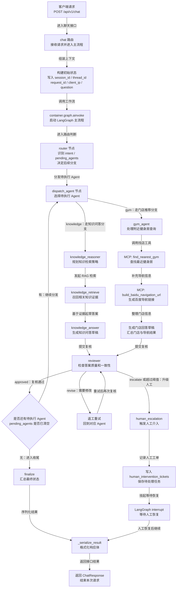
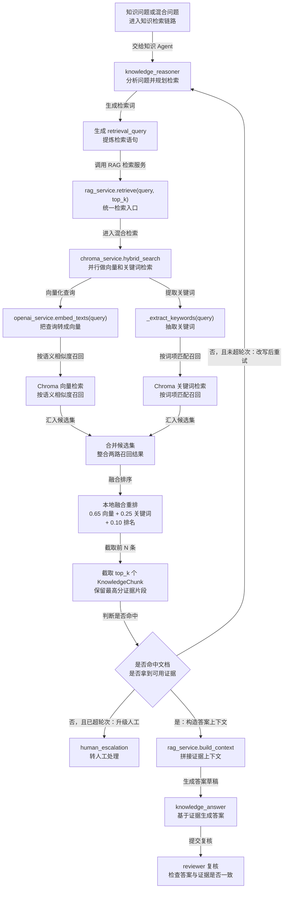

# FitPilot

FitPilot 是一个基于 `FastAPI + LangGraph` 的智能健身后端项目，提供健身知识问答、基于 IP 的附近健身房查询、RAG 检索、MCP 风格工具调用、流式事件输出，以及人工介入兜底能力。

## 功能概览

- 健身知识问答：结合私有知识库做检索增强回答。
- 附近健身房推荐：根据客户端 IPv4 在 MySQL 中定位城市并查找最近门店。
- 导航链接生成：为命中的健身房生成百度地图导航链接。
- 多 Agent 工作流：通过 LangGraph 编排路由、检索、回答、评审和人工接管。
- SSE 流式输出：前端可订阅图节点、工具调用、Token 和最终结果事件。
- MCP 工具注册：定位和导航能力通过统一工具协议暴露，便于扩展。

## 技术栈

- `FastAPI`
- `LangGraph`
- `OpenAI Python SDK`
- `ChromaDB`
- `SQLAlchemy + aiomysql`
- `sse-starlette`

## 目录说明

下面按树状结构说明各个文件夹用途。`venv` 内部的第三方依赖子目录很多，这里只说明它的整体作用，不逐个展开。

```text
fitpilot/
├── .idea/ IDE 工程配置目录
│   └── inspectionProfiles/ IDE 代码检查规则配置
├── app/ 项目主代码目录
│   ├── api/ FastAPI API 层，负责依赖注入和接口组织
│   │   └── routes/ 具体路由实现，包含健康检查、聊天和知识库接口
│   ├── core/ 通用基础能力，包含配置、日志、重试、事件和错误定义
│   ├── db/ 数据库相关代码，包含异步会话管理和 ORM 模型
│   ├── graph/ LangGraph 工作流定义，负责多 Agent 编排、状态流转和提示词
│   ├── mcp/ MCP 协议适配层，负责工具注册、协议路由和客户端调用
│   ├── models/ Pydantic 模型和领域模型定义
│   ├── repositories/ 数据访问层，封装 MySQL 查询逻辑
│   ├── runtime/ 运行时容器，负责装配数据库、OpenAI、Chroma、RAG、MCP 和 Graph
│   └── services/ 服务层，封装 OpenAI、Chroma、RAG 和健身房业务能力
├── data/ 预留数据目录，当前为空，可放原始文档、样例数据或导入文件
├── scripts/ 辅助脚本目录，当前主要用于初始化知识库种子数据
├── sql/ SQL 脚本目录，当前提供 MySQL 建表和演示数据初始化脚本
├── storage/ 运行时持久化数据目录
│   └── chroma/ Chroma 向量库默认落盘目录
├── tmp_chroma/ 临时 Chroma 数据目录，通常用于调试或早期实验数据
├── venv/ 本地 Python 虚拟环境目录，包含解释器、依赖和脚本命令
└── __pycache__/ Python 字节码缓存目录，根目录、app 子目录和 scripts 下都可能出现
```

## 关键文件

- `main.py`：本地开发启动入口，默认以 `uvicorn` 在 `8000` 端口运行。
- `app/main.py`：FastAPI 应用创建入口，注册中间件、路由和生命周期。
- `.env.example`：环境变量示例。
- `requirements.txt`：项目 Python 依赖清单。
- `sql/mysql_init.sql`：MySQL 表结构和演示数据初始化脚本。
- `scripts/seed_knowledge.py`：向 Chroma 写入演示知识文档的脚本。

## 快速开始

### 1. 创建虚拟环境

```powershell
python -m venv venv
.\venv\Scripts\Activate.ps1
```

### 2. 安装依赖

```powershell
pip install -r requirements.txt
```

### 3. 配置环境变量

复制环境变量模板：

```powershell
Copy-Item .env.example .env
```

至少需要确认以下配置：

- `OPENAI_API_KEY`：必填。没有它时，LLM 对话、向量化和知识库导入都无法正常执行。
- `FITPILOT_MYSQL_DSN`：MySQL 连接串。
- `FITPILOT_CHROMA_PATH`：Chroma 持久化目录，默认是 `./storage/chroma`。
- `OPENAI_BASE_URL`：如需接入兼容 OpenAI 的代理服务，可选填写。

完整配置项请参考 `.env.example`。

### 4. 初始化 MySQL

```powershell
mysql -uroot -ppassword < sql/mysql_init.sql
```

该脚本会创建以下表：

- `ip_location_ranges`
- `gyms`
- `human_intervention_tickets`

同时会插入一批演示 IP 段和健身房数据。

### 5. 初始化知识库

```powershell
python scripts/seed_knowledge.py
```

这个步骤会调用 OpenAI Embedding 接口，将演示文档写入 Chroma，因此必须先配置好 `OPENAI_API_KEY`。

### 6. 启动服务

```powershell
python main.py
```

启动后可访问：

- 接口文档：`http://127.0.0.1:8000/docs`
- 健康检查：`http://127.0.0.1:8000/health`

## 工作流说明

一次聊天请求的大致执行路径如下：

1. `router` 判断问题属于知识问答、门店推荐，还是二者混合。
2. `knowledge` 分支会做检索规划、Chroma 检索和答案生成。
3. `gym` 分支会通过 MCP 工具查找最近健身房并生成导航链接。
4. `reviewer` 对草稿结果复核，不通过时要求重试或升级人工。
5. 超过重试阈值后写入 `human_intervention_tickets`，等待人工恢复流程。

## 流程图

### Agent 回答接口调用流程

下面这张图对应 `POST /api/v1/chat` 的主链路。`POST /api/v1/chat/stream` 复用同一套 Graph，只是把 `graph.ainvoke()` 改成 `graph.astream_events()`，并通过 SSE 持续推送中间事件。图中保留英文节点名用于和代码对照，后面的中文用于说明职责，连线上的中文表示流转动作或判断条件。



### RAG 检索流程

下面这张图对应 `knowledge` Agent 的检索链路；`POST /api/v1/knowledge/search` 也会复用其中的 `rag_service.retrieve()` 与 `chroma_service.hybrid_search()`，只是不会进入答案生成和 reviewer 阶段。



## 主要接口

| 方法 | 路径 | 说明 |
| --- | --- | --- |
| `GET` | `/health` | 查看服务、MySQL、Chroma、OpenAI 开关和 MCP 工具状态。 |
| `POST` | `/api/v1/chat` | 普通聊天接口，返回聚合后的最终结果。 |
| `POST` | `/api/v1/chat/stream` | SSE 流式聊天接口，返回节点事件、Token 和最终结果。 |
| `POST` | `/api/v1/chat/human-resume/{thread_id}` | 人工处理后恢复已中断的工作流。 |
| `POST` | `/api/v1/knowledge/documents` | 批量写入知识文档。 |
| `POST` | `/api/v1/knowledge/search` | 搜索知识库。 |
| `POST` | `/mcp` | MCP 风格工具路由，支持 `initialize`、`tools/list`、`tools/call`。 |

## 请求示例

### 1. 健身知识问答

```bash
curl -X POST "http://127.0.0.1:8000/api/v1/chat" \
  -H "Content-Type: application/json" \
  -d "{\"question\":\"增肌期蛋白质应该怎么安排？\"}"
```

### 2. 查询附近健身房

```bash
curl -X POST "http://127.0.0.1:8000/api/v1/chat" \
  -H "Content-Type: application/json" \
  -d "{\"question\":\"帮我找附近的健身房并给导航\",\"client_ip\":\"203.0.113.8\"}"
```

说明：

- 本地直接请求时，`127.0.0.1` 不在演示 IP 表内。
- 如需测试门店推荐，请显式传 `client_ip`。
- 演示库里已配置的测试网段包括 `203.0.113.x`、`198.51.100.x`、`192.0.2.x`。

### 3. 流式聊天

```bash
curl -N -X POST "http://127.0.0.1:8000/api/v1/chat/stream" \
  -H "Content-Type: application/json" \
  -d "{\"question\":\"帮我推荐一个附近健身房\",\"client_ip\":\"198.51.100.8\"}"
```

常见 SSE 事件类型包括：

- `graph_start`
- `node_start`
- `thinking`
- `tool_start`
- `tool_end`
- `token`
- `review`
- `result`
- `done`
- `error`

### 4. 人工恢复流程

当某次请求返回 `requires_human=true` 时，可使用响应中的 `thread_id` 恢复工作流：

```bash
curl -X POST "http://127.0.0.1:8000/api/v1/chat/human-resume/<thread_id>" \
  -H "Content-Type: application/json" \
  -d "{\"approved\":true,\"final_answer\":\"这是人工确认后的回复\",\"note\":\"人工已处理\"}"
```

## 知识库接口示例

### 写入文档

```bash
curl -X POST "http://127.0.0.1:8000/api/v1/knowledge/documents" \
  -H "Content-Type: application/json" \
  -d "{
    \"documents\": [
      {
        \"document_id\": \"doc-001\",
        \"title\": \"训练后恢复建议\",
        \"source\": \"manual\",
        \"section\": \"recovery\",
        \"content\": \"训练后应优先保证睡眠、蛋白质和水分补充。\",
        \"tags\": [\"恢复\", \"睡眠\"],
        \"metadata\": {}
      }
    ]
  }"
```

### 搜索文档

```bash
curl -X POST "http://127.0.0.1:8000/api/v1/knowledge/search" \
  -H "Content-Type: application/json" \
  -d "{\"query\":\"减脂期力量训练怎么安排\",\"top_k\":5}"
```

## MCP 调试示例

列出当前可用工具：

```bash
curl -X POST "http://127.0.0.1:8000/mcp" \
  -H "Content-Type: application/json" \
  -d "{\"jsonrpc\":\"2.0\",\"id\":1,\"method\":\"tools/list\",\"params\":{}}"
```

## 开发提示

- `gym` 分支只支持 IPv4 地址定位。
- 服务启动时对依赖采用“尽量启动”的策略，即使 MySQL 异常，接口仍会启动，便于通过 `/health` 排查问题。
- 知识库导入、检索向量化和 LLM 问答都依赖 OpenAI 配置。
- `storage/chroma/` 与 `tmp_chroma/` 都属于本地运行数据目录，删除前请确认是否需要保留历史向量数据。
